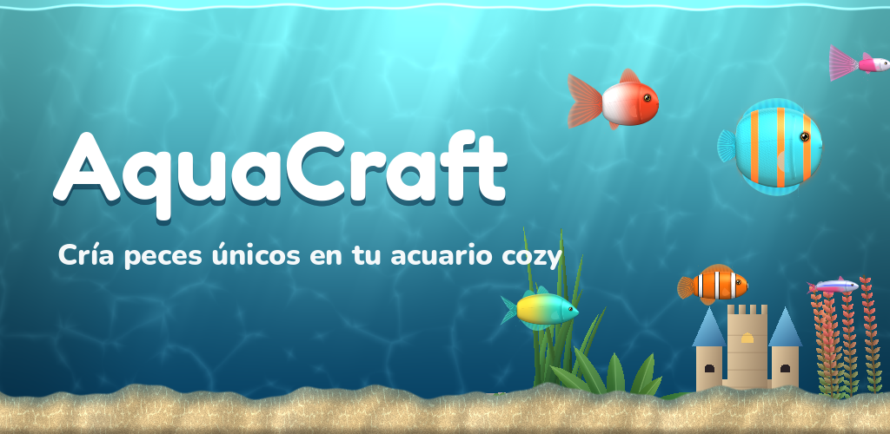

# AquaCraft 🐠

Simulador *cozy* de acuarios para Android: cuida el agua, alimenta a tus peces, cría ejemplares
únicos con genética y mutaciones, decora la pecera y crece hasta el acuario Monumental de 1000 L.

<p align="center"></p>

## Qué incluye (v0.7)

| Sistema | Detalle |
|---|---|
| Pecera viva | Agua con rayos de luz y cáusticas, plantas que ondulan, burbujas, motas, luz día/noche según la hora real |
| Modos | Relax (sin algas, desgaste ni parámetros), Normal y Realista (márgenes estrictos, la habitación se enfría de noche, los peces pueden morir). Se cambia en Misiones |
| Agua | Dulce o salada: cada una con sus peces, plantas/corales, sustratos y equipo. En salada la sal se concentra al evaporarse (reponer agua o instalar reposición automática). Se puede convertir la pecera |
| Peces | 29 especies (17 de agua dulce, 12 marinas) con anatomía propia por shader y 11 patrones. Carácter: peces de banco, territoriales, matones, mordedores de aletas y depredadores (avisos al comprar y estrés si conviven mal) |
| Vida | Edad y vejez (en Realista mueren de viejos), 3 enfermedades (punto blanco contagioso, hongos, podredumbre de aletas) con sus tratamientos; el lábrido limpiador previene el punto blanco y el pleco come algas |
| Pedidos | Clientes que piden peces concretos (especie, color, patrón, mutación o rareza) y pagan mucho más; caducan en 24 h |
| Colección | Álbum con las 29 especies (siluetas de las que faltan), variantes descubiertas y premio por especie |
| Racha y eventos | Premio diario creciente (el 7º día, huevo misterioso) y eventos de temporada (Halloween, Navidad, primavera, verano) con pez y adorno limitados |
| Varias peceras | Hasta 3 (dulce y salada a la vez); se cambia tocando su nombre y los peces se pueden mudar |
| Sonido | Música lo-fi, ambiente de burbujas y efectos, todo generado por código (`tools/gen_audio.py`); vibración |
| Avisos | Notificaciones locales en Android (hambre, huevos, mantenimiento, racha) con un plugin propio (`plugins_src/aqua_notify`) |
| Ajustes | Música, efectos, vibración, avisos, modo de juego, tutorial, política de privacidad y borrar partida |
| Nombres | Ponle nombre a cada pez y actívalos sobre la pecera con el botón «Nombres» |
| Genética | Colores, patrón y tamaño heredados; mutaciones Neón, Albino, Velo, Color raro, Patrón raro y Gigante; 5 rarezas |
| Cuidados | Hambre, salud, felicidad, temperatura, pH, oxígeno, algas en el cristal y suciedad en el fondo. Estantería de pared con 4 objetos: limpiacristales, bote «Comida» (elige alimento), bote «Agua» (parámetros + pH+, pH−, oxígeno, sal marina, antialgas, reponer agua dulce) y sifón para aspirar el fondo. Cada molestia de un pez tiene remedio y su ficha te dice cuál |
| Ritmo | Pausado y realista: un pez aguanta más de un día sin comer, las algas y el fondo tardan días en ensuciarse y estando fuera nadie muere (en Realista vuelven débiles) |
| Dietas | Cada especie come lo suyo: corydoras solo gránulos de fondo, gramma y gobio de fuego solo artemia, cirujanos solo nori. El bocadillo de hambre enseña qué piden |
| Peceras | Se empieza en una pecera redonda de cristal **sin ningún aparato**; luego Nano 20 L, Comunitario 60 L, Panorámico 200 L y Monumental 1000 L |
| Equipo | 16 aparatos en 6 huecos (filtro, calentador, aireador, luz, termómetro, reposición) y 3 calidades: básico (barato, rinde menos, calienta despacio y **se rompe** si llega a 0%), estándar y pro. Cada pecera limita qué huecos y qué calidad admite. Desgaste visible (suciedad, luz que parpadea, aviso "!") y mantenimiento manteniendo pulsado. Se pueden retirar y guardar para volver a instalarlos |
| Plantas | Las plantas vivas crecen con los días (más con luz y tierra nutritiva); al podarlas dan un esqueje |
| Decoración | Modo Decorar: arrastra cada pieza **y cada aparato** donde quieras, voltéala, ponla al fondo, en medio o delante de los peces, y guárdala en el inventario. **Moldear la arena**: desliza arriba/abajo para hacer montañas o valles (todo se apoya en el terreno) |
| Mercado | Peces (+2 exóticos al día), 4 peceras, 12 equipos, 14 decoraciones, 5 sustratos, 3 comidas |
| Tutorial | Guía interactiva la primera vez (alimentar, limpiar, mantenimiento, criar, decorar); se puede repetir desde Misiones |
| Progresión | Nivel de acuarista, 17 misiones de historia (hacen de tutorial), 3 diarias + bonus, colección de variantes |
| Tiempo real | El acuario sigue vivo con la app cerrada (hasta 48 h) sin que muera ningún pez: es un juego cozy |

Pendiente para próximas versiones: minijuegos y traducciones.

## Abrir el proyecto

1. Instala [Godot 4.7.2](https://godotengine.org/download) (versión estándar, no .NET).
2. *Importar* → elige `project.godot` → **F5** para jugar. El ratón simula el dedo.

Todo el equilibrio (precios, tiempos, niveles, misiones) está en [`scripts/catalog.gd`](scripts/catalog.gd).

## Estructura

```
scripts/
  game.gd          Autoload: estado, simulación (también offline), economía, misiones, guardado
  catalog.gd       Datos: especies, peceras, equipo, decoración, comida, misiones
  genetics.gd      Genes, cruces, mutaciones, rareza y precio
  main.gd          Escena: habitación, mueble, pecera y toques en el agua
  tank_view.gd     Capas de la pecera (agua, sustrato, decoración, peces, cristal)
  fish_actor.gd    Comportamiento de cada pez
  decor_art.gd     Plantas y adornos dibujados en código
  ui/              HUD, tienda, fichas de peces, misiones, iconos vectoriales
shaders/           agua, sustrato, cristal con algas, peces, plantas, habitación
tests/             test_core.gd (lógica) y smoke.gd (recorre toda la interfaz)
tools/             generadores de texturas e iconos / gráfico de la tienda
store/             gráfico destacado y textos de la ficha de Google Play
```

## Rendimiento

- Renderer **Compatibility** (OpenGL ES 3): funciona en casi cualquier Android desde la API 24.
- Sin texturas grandes: el arte es procedural (APK pequeño). Las únicas texturas pesan < 130 KB.
- Shaders sin bucles caros en el agua (2 lecturas de textura por píxel); la simulación corre 1 vez por segundo.
- La partida se guarda de forma atómica (fichero temporal + renombrado) para no perderla nunca.

## Probar en el móvil

Cada push a `main` lanza el workflow **Android** en GitHub Actions: pasa los tests y genera un APK de prueba.
Descárgalo en *Actions → última ejecución → Artifacts → AquaCraft-apk*, pásalo al móvil e instálalo
(permite "orígenes desconocidos").

Tests en local:

```bash
godot --headless -s tests/test_core.gd
godot --headless --resolution 720x1280 -s tests/smoke.gd -- demo=1
xvfb-run godot --resolution 720x1280 -s tests/scroll_check.gd -- demo=1   # arrastrar sobre tarjetas desplaza la lista
```

Capturas para la tienda (necesita pantalla): `godot -- demo=2 open=shop:0 shot=captura.png`
(`demo=0..4` elige la pecera (0 = redonda), `water=salada` y `mode=realista` opcionales; `open` = `shop:N`, `fish:N`, `missions`, `thermo`, `feed`, `clean`, `dirty`, `edit`, `equip:filter`, `decor`, `tutorial:N`, `algae:N`, `wear:N`, `sculpt`, `food`, `water`, `floor`, `names`, `missions:N`, `settings`, `tanks`, `streak`;
`event=halloween` fuerza un evento). Vídeo: ver `store/ficha_google_play.md`.

## Publicar en Google Play

1. **Crea tu clave de subida** (una sola vez; guárdala fuera del repo y haz copia):
   ```bash
   keytool -genkeypair -v -keystore aquacraft-upload.keystore -alias aquacraft \
     -keyalg RSA -keysize 2048 -validity 10000
   ```
2. **Secretos del repo** (Settings → Secrets and variables → Actions):
   - `ANDROID_KEYSTORE_BASE64` → salida de `base64 -w0 aquacraft-upload.keystore`
   - `ANDROID_KEY_ALIAS` → `aquacraft`
   - `ANDROID_KEYSTORE_PASSWORD` → la contraseña que elegiste
3. Con los secretos puestos, cada push genera también **AquaCraft.aab** (artefacto `AquaCraft-aab`),
   con `versionCode` = número de ejecución. Si haces push de un tag `v0.2.0`, la versión visible será 0.2.0.
4. En [Play Console](https://play.google.com/console): crea la app, activa *Play App Signing*, sube el AAB
   a **Prueba interna** y completa la ficha con los textos de [`store/ficha_google_play.md`](store/ficha_google_play.md).

> ⚠️ El identificador `com.aquiles.aquacraft` (en `export_presets.cfg`) **no se puede cambiar** después de la
> primera subida. Cámbialo antes si prefieres otro.

Requisitos que ya cumple: target API 36 (obligatorio desde el 31/08/2026), AAB, 64 bits, sin permisos peligrosos,
sin conexión a internet ni recogida de datos.

## Licencias

Código: todos los derechos reservados (proyecto privado). Fuentes Nunito y Fredoka bajo
[SIL Open Font License](assets/fonts/OFL-Nunito.txt) (incluidas). Motor: Godot (MIT).
